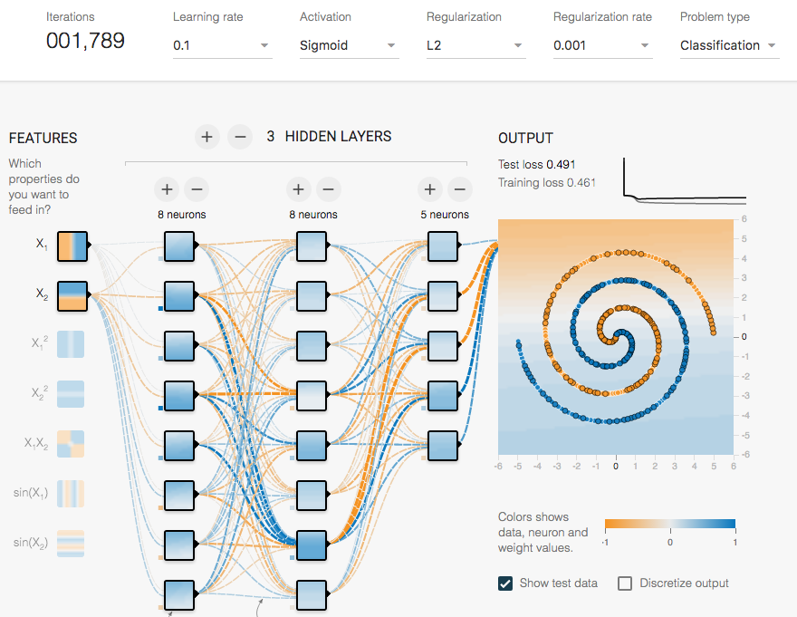

Title: ICYM AI & ML - Week #30 of 2016
Date: 2016-07-30
Category: AI, ML, Review

## Articles

* [Understanding neural networks with TensorFlow Playground](https://cloud.google.com/blog/big-data/2016/07/understanding-neural-networks-with-tensorflow-playground) 

## Papers

## Talks

## Yolo

* [Baidu AI Composer](https://www.youtube.com/watch?v=Ics9CjRSMfc)

* Tensorflow Playground is fun. That's is how you do separate a spiral binary dataset:

{:height="300px" width="400px"} {:height="300px" width="400px"} 

* That's is how you do not separate a spiral binary dataset:

{:height="300px" width="400px"} {:height="300px" width="400px"} {:height="300px" width="400px"}  {:height="300px" width="400px"}  {:height="300px" width="400px"}  {:height="300px" width="400px"} 
