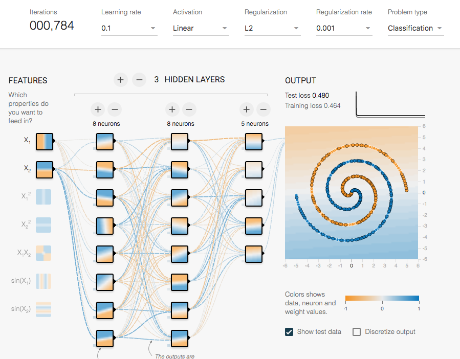

Title: Studies in Machine Learning & AI - #3
Date: 2016-07-30
Category: AI & ML

{:height="300px" width="400px"}

## Papers

** This is a selection of quintessential papers for anyone starting on Deep Learning (Thanks to Joe Zimmerman):**

* [ImageNet Classification with Deep Convolutional Neural Networks (Krizhevsky, *et al.*, 2014)](https://papers.nips.cc/paper/4824-imagenet-classification-with-deep-convolutional-neural-networks.pdf). AlexNet.
* [Very Deep Convolutional Networks for large-scale image recognition (Simonyan, *et al.*, 2014)](https://arxiv.org/pdf/1409.1556.pdf
). Image classification.
* [Improving neural networks by preventing co-adaptation of feature detectors]( https://arxiv.org/pdf/1207.0580.pdf
). Dropout and regularization.
* [FaceNet: A Unified Embedding for Face Recognition and Clustering (Schroff, *et al.*, 2015)](https://arxiv.org/pdf/1503.03832v3.pdf
).  Metric learning (FaceNet). (Metric learning)
* [Deep Residual Learning for Image Recognition (He, *et al.*, 2015)](https://arxiv.org/pdf/1512.03385v1.pdf
). Very deep networks (ResNet).
* [Neural Machine Translation by jointly learning to align and translate (Bahdanau, *et al.*, 2015)](https://arxiv.org/pdf/1409.0473v7.pdf
). RNNs, LSTMs, GRUs - machine translation with alignment.
* [Deep structured output learning for unconstrained text recognition (Jaderberg,  *et al.*, 2014)](http://arxiv.org/pdf/1412.5903v5.pdf
).  Text recognition.
* [Deep Speech 2: End-to-End Speech Recognition in English and Mandarin (Amodei,  *et al.*, 2015)](https://arxiv.org/pdf/1512.02595v1.pdf
). Speech recognition (DeepSpeech 2).
* [A Neural Algorithm of Artistic Style (Gatys,  *et al.*, 2015)](http://arxiv.org/pdf/1508.06576v2.pdf
). Artistic style transfer.
* [Neural GPUs learn algorithms (Kaiser, *et al.*, 2015)](http://arxiv.org/pdf/1511.08228v3.pdf). A Neural GPUs.
* [AI2: Training a big data machine to defend (Kalyan, *et al.*, 2016)](http://people.csail.mit.edu/kalyan/AI2_Paper.pdf).
* [Tensor Flow Whitepaper, (Abadi, *et al.*, 2014)](http://download.tensorflow.org/paper/whitepaper2015.pdf).
* [Torchnet: An Open-Source Platform for (Deep) Learning Research, (Collobert, *et al.*, 2016)](https://lvdmaaten.github.io/publications/papers/Torchnet_2016.pdf).

## News

* [Using Keras and Deep Q-Network to Play FlappyBird](https://yanpanlau.github.io/2016/07/10/FlappyBird-Keras.html). Hands-on on Google DeepMind's Deep Q-Network.
* [Neural Networks, Manifolds, and Topology](http://colah.github.io/posts/2014-03-NN-Manifolds-Topology/). This is a 2-years-old article, but a very well-written high-level explanation of the topology of low-dimensional NNs. "*The task of a classification algorithm is fundamentally to separate a bunch of tangled manifolds.*"
* [Calculus on Computational Graphs: Backpropagation](http://colah.github.io/posts/2015-08-Backprop/). Backpropagation explained in a very well-written text.
* [Understanding LSTM Networks](http://colah.github.io/posts/2015-08-Understanding-LSTMs/). Another hit :).
* [Visualizing Representations: Deep Learning and Human Beings.](http://colah.github.io/posts/2015-01-Visualizing-Representations/) Another Christopher Olah's great post, now on NN's different layers representations, tanging some philosophic aspects of it.
* [Karpathy's t-SNE visualization of CNN codes.](http://cs.stanford.edu/people/karpathy/cnnembed/) He takes the 50k ILSVRC 2012 validation images, extracts the 4096-dimensional fc7 CNN features using Caffe and then uses Barnes-Hut t-SNE to compute a 2-dimensional embedding that respects the high-dimensional (L2) distances. 
* [NVIDIA's Accelerating AI with GPUs: A New Computing Model](https://blogs.nvidia.com/blog/2016/01/12/accelerating-ai-artificial-intelligence-gpus/).
* [Torchnet: Lighting the way to deep machine learning](https://code.facebook.com/posts/580706092103929/lighting-the-way-to-deep-machine-learning/). "*[Torchnet](https://github.com/torchnet/torchnet) is different from frameworks such as Caffe, Chainer, TensorFlow, and Theano, in that it does not focus on performing efficient inference and gradient computations in deep networks. Instead, Torchnet provides a framework on top of a deep learning framework that makes rapid experimentation easier.*"

## Videos

* [Large-Scale Deep Learning for Intelligent Computer Systems by Jeff Dean](http://static.googleusercontent.com/media/research.google.com/en//pubs/archive/44921.pdf).
* [Prof. Adrian Owen on The Search for Consciousness: detecting awareness in the vegetative state (2015)](https://www.youtube.com/watch?v=JeBkUtYvBBM).
* [Baidu AI Composer](https://www.youtube.com/watch?v=Ics9CjRSMfc).

## Tools

* [Understanding neural networks with TensorFlow Playground](https://cloud.google.com/blog/big-data/2016/07/understanding-neural-networks-with-tensorflow-playground).  
* [Karpathy's ConvNetJS viz tool.](http://cs.stanford.edu/people/karpathy/convnetjs//demo/classify2d.html)

## Cool Plots
 

*  Remember that the hidden layer learns a representation so that the data is linearly separable, so that's is how you do separate a spiral two-dimensional dataset using Tensorflow playground and Convnetjs:
	
With tanh:

 {:height="300px" width="400px"}  {:height="300px" width="400px"}   {:height="300px" width="400px"}   {:height="300px" width="400px"} 

With ReLU:

{:height="300px" width="400px"}

* That's is how you do not separate a spiral two-dimensional dataset:

{:height="300px" width="400px"} {:height="300px" width="400px"} {:height="300px" width="400px"}  {:height="300px" width="400px"}  {:height="300px" width="400px"}  {:height="300px" width="400px"} 

{:height="600px" width="900px"}

{:height="600px" width="900px"}

